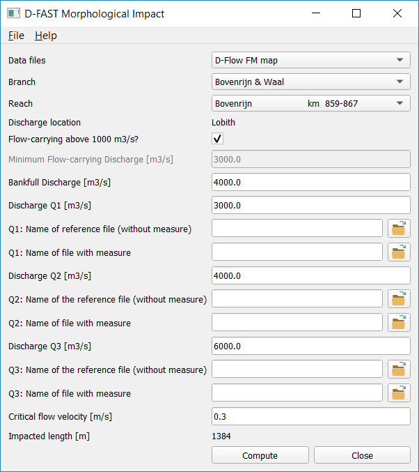

# Software Requirement

## Introduction

The new program is to replace WAQMORF which was developed for the SIMONA system.
The essence of the requirements is that the new code should be consistent with the WAQMORF version except for the fact that it supports new D-Flow FM map-files.

WAQMORF didn't use an input file as such to run.
The program required the user to answer a number of questions interactively.
The answers to the questions could be prepared in advance and written to a textfile that could subsequently be redirected to standard in to mimic running the program in batch mode.
For the new software we require a proper input file.

The output of WAQMORF consists of a simple text file report and three spatial data files in so-called SIMONA BOX file format.
Since the latter output file format is dedicated to structured grid models in the SIMONA modeling system, the new program should use a different file format that is (also) suitable for representing data from unstructured D-Flow FM models.

## Functional Requirements

1. This program must give the same results for the same data as WAQMORF.
1. Users must be able to run this program in batch mode from the command line.
1. Users must be able to run the analysis based on D-Flow FM results.
1. Users must be able to provide all data via an input file.
1. The input file must be easy to edit for users, i.e.~a text file.
1. The report output must be a simple text file consistent with WAQMORF.
1. The spatial output must be easy to visualize in common software.

1. The should read relevant data directly from D-Flow FM map-files instead of intermediate XYZ files as required by WAQMORF for SIMONA results.

1. The input file could use the ini-format consistent with D-Flow FM input files.
1. A simple graphical user interface could support users in process of creating the input file.

1. It would be nice if the software would be more generally applicable than just the Dutch rivers.
1. It would be nice if the software would be able to run besides Dutch also in English.

## Non-functional requirements

1. The performance of the tools must be similar to that of WAQMORF, i.e.~it must run within seconds.
1. The software must be version controlled.
1. The software must have formal testing and support.
1. The software must run on Windows.
1. The software must be easy to distribute.
1. The software must have a user manual.
1. The software must have technical documentation.

1. The software should run on any common operating system.
1. The software should be available as open source.

# Code Design

## Introduction

The original WAQMORF code was developed in FORTRAN.
For D-FAST Morphological Impact we have selected Python because

* More domain specialists and users are familiar with Python and it's therefore easier for development cycle.
* Adding a graphical user interface (GUI) is easier in other languages than FORTRAN and by using the same language for kernel and GUI makes the code more consistent and reusable.
* The algorithm doesn't require large amounts of computations, so a native language isn't needed for adequate performance.
* The Python environment is available for free contrary to MATLAB which is also widely used in this community.
* Python supposedly allows for the creation of relatively small redistributable binaries.
* Python combines well with the open source nature of this software and other developments in the Delft3D / D-HYDRO environment.

The software uses a number of Python modules for specific functionality.
Most importantly the code builds on

* `netCDF4` for reading and writing netCDF files.
* `NumPy` for the numerical computations using arrays.
* `PyQt5` for the graphical user interface.

The next two sections describe the file formats used by the software and the subdivision into modules.

## File formats

The software distinguishes 6 files:

* The *rivers configuration file* defines the branches and reaches, and all parameter settings specific for the overall system, per branch or per reach.
* The *dialog text file* defines all strings to be used in the interaction with the users (GUI, report, or error messages).
* The *analysis configuration file* defines the settings that are relevant for a specific execution of the algorithm, i.e.~for a specific branch, reach and measure.
* The *simulation result files* define the spatial variations in the velocities and water depths as needed by the algorithm.
* The *report file* contains a logging of the settings and lumped results for the analysis.
* The *spatial output file* contains the estimate of the spatial variation in the sedimentation and erosion patterns that will result from the measure (minimum, mean and maximum).

Each file type is addressed separately in the following subsections.

### rivers configuration file

The rivers configuration file follows the common ini-file format.
The file must contain a `[General]` block with a keyword `Version` to indicate the version number of the file.
The initial version number will be `1.0`.

Version 1.0 files must contain one `[Branches]` block defining the branches (in Dutch: takken) supported by the system and optionally global default values for parameters.
For every branch named in the `[Branches]` block, the file must contain a data block corresponding to the branch name that contains further information on that branch.
That block defines the reaches (in Dutch: stukken) to be distinguished as well as the branch or reach specific parameter settings.
Further details follow below.

| Block          | Keyword    | Description |
|----------------|------------|-------------|
| General        | Version    | Version number. Must be `1.0` |
| Branches       | Branch<i>  | Name of branch <i>, i.e. BranchName<i> |
| BranchName<i>  | Reach<j>   | Name of reach <j> within branch <i> |
| BranchName<i>  | QLocation  | Location at which discharges for branch <i> are defined |
| B*             | QBankfull  | Typical bankfull discharge [m3/s] |
| B*             | QStagnant  | Discharge [m3/s] below which main channel flow can be assumed stagnant |
| B*             | QMin       | Minimum discharge [m3/s] at which measure becomes active |
| B*             | QFit       | Two discharges [m3/s] used for exceedance curve |
| B*             | QLevels    | Four discharges [m3/s] used by algorithm |
| B*             | dQ         | Two discharge adjustments [m3/s] used by algorithm |
| B*             | NWidth     | Normal width [m] of main channel |
| B*             | PRLow      | Low flow propagation rate [km/yr] |
| B*             | PRHigh     | High flow propagation rate [km/yr] |
| B*             | UCrit      | Critical (minimum) velocity [m/s] for sediment transport |

All keywords listed for block B* may occur either in the `[Branches]` block or in one of the branch specific blocks where they may optionally be concatenated with the reach number <j>.
Those keywords may thus occur in three flavours:

1. Plain keyword in block `[Branches]`: global default value valid for all branches
1. Plain keyword in branch specific block: default value for that branch (overrules any global default)
1. Keyword followed by reach number <j> in branch specific block: value valid for that reach on that branch.

**Example**

The following excerpt of the default `Dutch_rivers.cfg` configuration file shows the `[General]` and `[Branches]` blocks as well as the first part of the `[Bovenrijn & Waal]` block for the first branch.
It includes a global value of 0.3 for `UCrit` and 100 for `QMin`.
The other parameters are specified at branch level and mostly uniform for the whole branch.
Only `NWidth` and `PRLow` vary depending on the reach selected.

    [General]
        Version    = 1.0

    [Branches]
        Name1      = Bovenrijn & Waal
        Name2      = Pannerdensch Kanaal & Nederrijn-Lek
        Name3      = IJssel
        Name4      = Merwedes
        Name5      = Maas
        UCrit      = 0.3
        QMin       = 1000

    [Bovenrijn & Waal]
        QLocation  = Lobith
        QBankfull  = 4000
        QStagnant  = 800
        QFit       = 800  1280
        QLevels    = 3000  4000  6000  10000
        dQ         = 1000  1000
        PRHigh     = 3.65
        
        Reach1     = Bovenrijn                    km  859-867
        NWidth1    = 340
        PRLow1     = 0.89
        
        Reach2     = Boven-Waal                   km  868-886
        NWidth2    = 260
        PRLow2     = 0.81

        ... continued ...

### dialog text file

The dialog text file uses the block labels enclosed by square brackets of the common ini-file format, but the lines in between the blocks are treated verbatim and don't list keyword/value pairs.
Every print statement in the program is associated with a short descriptive identifier.
These identifiers show up in the dialog text file as the block labels.
The text that follows the block label will be used at that location in the program.
The order of the blocks in the file is not important.
Please note that every line is used as is, so don't add indentations or blank lines unless you want those to show up during the program execution.
Most blocks may contain any number of lines, but some blocks may only contain a single line.
Some data blocks may contain one or more Python-style placeholders used for inserting values.

### Example

The following excerpt of the default `messages.NL.cfg` dialog text file shows the string definition for 5 identifiers, namely '' (the identifier for an empty line), 'header', 'confirm', 'confirm_or' and 'confirm_or_restart'.
The header string contains one placeholder, namely `{version}` for the the version number.

    []
    
    [header]
    Dit programma is de "WAQUA vuistregel" voor het schatten
    van lokale morfologische effecten door een lokale ingreep
    (zie RWS-WD memo WAQUA vuistregel 20-10-08).
    
    Het is een inschatting van evenwichtsbodemveranderingen
    in het zomerbed die als gevolg van een ingreep en zonder
    aangepast beheer na lange tijd ontstaan.
    
    Dit betreft het effect op de bodem in [m]:
    
        jaargemiddeld zonder baggeren
        maximaal (na hoogwater) zonder baggeren
        minimaal (na laagwater) zonder baggeren
    
    Met deze bodemveranderingen kunnen knelpunten worden
    gesignaleerd. De resultaten zijn niet direkt geschikt
    voor het bepalen van de invloed op vaargeulonderhoud!
    
    De jaarlijkse sedimentvracht door de rivier bepaalt de
    termijn waarbinnen dit evenwichtseffect kan ontwikkelen.'
    
    
    Dit is versie {version}.
    
    [confirm]
    Bevestig met "j" ...
    
    [confirm_or]
    Bevestig met "j", anders antwoord met "n" ...
    
    [confirm_or_restart]
    Bevestig met "j", of begin opnieuw met "n" ...
    
    ... continued ...

### analysis configuration file

The analysis configuration file follows the common ini-file format.
The file must contain a `[General]` block with a keyword `Version` to indicate the version number of the file.
The initial version number will be `1.0`.

Version 1.0 files must contain in the `[General]` block also the keywords `Branch` and `Reach` to identify the branch (in Dutch: tak) and reach (in Dutch: stuk) in which the measure is located.
The specified names may be shortened, but they should uniquely identify the branch and reach amongst the names of the other branches and reaches.
Optionally, the same block may also contain `Qmin`, `QBankfull` and `UCrit` values representative for this particular measure if they differ from those typical for the selected reach.
These items are sufficient for a basic analysis.
For a full spatial analysis the user needs to specify the names of the D-Flow FM map-files containing the results of the simulations without measure (reference) and with measure for the selected discharges Q1, Q2, and Q3.

| Block          | Keyword     | Description |
|----------------|-------------|-------------|
| General        | Version     | Version number. Must be `1.0` |
| General        | Branch      | Name of the selected branch   |
| General        | Reach       | Name of the selected reach    |
| General        | QMin        | Minimum discharge [m3/s] at which measure becomes active |
| General        | QBankfull   | Discharge [m3/s] at which measure reaches bankfull |
| General        | UCrit       | Critical (minimum) velocity [m/s] for sediment transport |
| Q1             | Discharge   | Discharge [m3/s] of the low flow simulation |
| Q1             | Reference   | Name of D-Flow FM map-file to be used for reference condition at Q1 |
| Q1             | WithMeasure | Name of D-Flow FM map-file that includes the measure at Q1 |
| Q2             | Discharge   | Discharge [m3/s] of the transitional regime |
| Q2             | Reference   | Name of D-Flow FM map-file to be used for reference condition at Q2 |
| Q2             | WithMeasure | Name of D-Flow FM map-file that includes the measure at Q2 |
| Q3             | Discharge   | Discharge [m3/s] of the high flow simulation |
| Q3             | Reference   | Name of D-Flow FM map-file to be used for reference condition at Q3 |
| Q3             | WithMeasure | Name of D-Flow FM map-file that includes the measure at Q3 |

The file names may be specified using relative or absolute paths.

**Example**

This example shows a complete analysis configuration file for a measure in the first branch/reach of the default `Dutch_rivers.cfg` configuration.
It reports the default settings.
Only the `Version`, `Branch`, `Reach`, `Reference` and `WithMeasure` keywords are required for the full analysis.

    [General]
      Version     = 1.0
      Branch      = Bovenrijn & Waal
      Reach       = Bovenrijn                    km  859-867
      Qmin        = 1000.0
      Qbankfull   = 4000.0
      Ucrit       = 0.3
    
    [Q1]
      Discharge   = 1000.0
      Reference   = Measure42/Q1/Reference/DFM_OUTPUT_Q1/Q1_map.nc
      WithMeasure = Measure42/Q1/Updated/DFM_OUTPUT_Q1/Q1_map.nc
    
    [Q2]
      Discharge   = 4000.0
      Reference   = Measure42/Q2/Reference/DFM_OUTPUT_Q2/Q2_map.nc
      WithMeasure = Measure42/Q2/Updated/DFM_OUTPUT_Q2/Q2_map.nc
    
    [Q3]
      Discharge   = 6000.0
      Reference   = Measure42/Q3/Reference/DFM_OUTPUT_Q3/Q3_map.nc
      WithMeasure = Measure43/Q3/Updated/DFM_OUTPUT_Q3/Q3_map.nc

### simulation result files

The WAQMORF program required that the user had extracted the cell centred velocity magnitude and water depth from the the WAQUA SDS-output files and stored in `xyz_<quantity>-zeta.00<1/2>.Q<i>` files.
D-FAST Morphological Impact supports these files when running in legacy mode (see section on `dfastmi_cli`).
When building on D-Flow FM simulations, D-FAST Morphological Impact reads the results directly from the NetCDF map-files.
These files may contain multiple time steps; the final time steps will be used for the analysis.

### report file

D-FAST Morphological Impact will write a report of the analysis.
This report file is a simple text file consistent with the earlier reports written by WAQMORF.
The length and content of the report vary depending on the availability of the simulation result files.

### spatial output file

The WAQMORF program wrote the spatial output in SIMONA BOX-file format which could be visualize when combined with the curvilinear grid of the original simulation.
D-FAST Morphological Impact still generates such files when run in legacy mode based on WAQUA results (see the `dfastmi_cli` section).

D-FAST Morphological Impact generates one UGRID NetCDF file containing the spatial results of the analysis.
The mesh information is copied from the D-Flow FM map file and the three data fields (erosion and sedimentation patterns for mean, minimum, and maximum impact) follow standardized conventions for data stored at cell centres (`face`-values) on an unstructured mesh.
As a result the data may be visualized using a number of visualization tools such as QUICKPLOT and QGIS.

## Listing of Modules

D-FAST Morphological Impact is subdivided into 4 modules:

* `dfastmi_io` for all file handling: reading of input and configuration files as well as writing of results files.
* `dfastmi_kernel` for all scientific steps of the algorithm
* `dfastmi_cli` for the command line interface (batch mode)
* `dfastmi_gui` for the graphical user interface

Each component is addressed separately in the subsections after the file descriptions.

### input/output module `dfastmi_io`

The `dfastmi_io` module contains all file handling routines for reading configuration files, processing NetCDF input and output files, and functions to support legacy input and output formats.

* `read_program_texts` fills a dictionary of dialog texts by reading the dialog text configuration file
* `read_rivers` reads the rivers configuration file
* `collect_values` support function for collecting branch/reach data for a single parameter
* `write_config` support function to write a nicely formatted analysis configuration file

* `read_fm_map` for reading data fields from the D-Flow FM map-file
* `copy_ugrid` for copying UGRID mesh information from the D-Flow FM map-file to the spatial output file
* `copy_var` support function for copying an individual NetCDF variable from NetCDF file to another
* `ugrid_add` for adding a single cell centred variable to a NetCDF file containing UGRID mesh data

* `read_waqua_xyz` for reading the xyz-files containing data exported from the WAQUA model (legacy function)
* `write_simona_box` for writing a SIMONA BOX-file (legacy function)

### core algorithm `dfastmi_kernel`

The `dfastmi_kernel` module contains all routines for that perform the mathematical processing steps of the algorithm.
This module also contains the main version number.

* `program_version` returns the version string of the current algorithm
* `char_discharges` for determining the characteristic discharges Q1, Q2 and Q3
* `char_times` for computing the associated time and weight factors
* `estimate_sedimentation_length` for computing the characteristic length scale of the impact
* `dzq_from_du_and_h` for computing the spatial pattern of dzq based on the change in velocity magnitude and local water depth
* `main_computation` for computing the minimum, mean and maximum impact patterns of the measure on the bed levels after one year

### command line interface `dfastmi_cli`

This module implements the command line version of D-FAST Morphological Impact.
Depending on the command line arguments it will run in either one of two modes:

1. Legacy mode mimicking the existing WAQMORF program.
It uses the same input and output files (report file and SIMONA BOX-files), but uses the new implementation of the algorithm and various configuration files.
2. Batch mode using input file.
It takes the analysis configuration file as input, obtains the relevant data from the D-Flow FM result files and writes the report and a single spatial results file.

The component will run in the legacy mode when the input file is not specified on the command line.
The following command line options are supported

| short | long             | description                                  |
|-------|:-----------------|:---------------------------------------------|
| -h    | --help           | show help text and exit                      |
| -r    | --rivers         | name of river configuration file             |
| -l    | --language       | name of dialog text file                     |
| -i    | --input_file     | name of analysis configuration file          |
|       | --reduced_output | write reduced SIMONA BOX files (legacy mode) |

This module is subdivided into the following routines:

* `parse_arguments` parses the command line arguments and decide on batch mode or legacy interactive mode
* `batch_mode` implements the overall analysis in batch mode
* `program_texts` selects the appropriate text from the dictionary of dialog texts (see `read_program_texts`)
* `log_text` print the selected text to screen or report

* `interactive_mode` implements the overall interactive loop (legacy mode)
* `check_discharge` to interactively verify whether simulation results are available for the requested discharges Q1, Q2 and Q3 and if not query for which alternative discharges then (legacy mode)
* `get_values` to obtain dzq values from xyz files (legacy mode)
* `get_bool`, `get_int`, `get_float` and `get_item` support functions to get boolean, integer, floating point input or branch/reach index from user interaction (legacy mode)

### graphical user interface `dfastmi_gui`

This module implements the graphical user interface version of D-FAST Morphological Impact.
It can be used to generate and edit the analysis configuration files used for evaluating a single measure.
This module doesn't have a legacy mode and doesn't support old SIMONA files.
The following command line options are supported

| short | long             | description                                  |
|-------|:-----------------|:---------------------------------------------|
| -h    | --help           | show help text and exit                      |
| -r    | --rivers         | name of river configuration file             |
| -l    | --language       | name of dialog text file                     |
| -i    | --input_file     | name of initial analysis configuration file  |

This module is subdivided into the following routines:

* `create_dialog` to create the graphical user interface
* `openFileLayout` support function to create a dialog entries of a text field with a browse for file option for all simulation result files options
* `activate_dialog` to hand over control to the user interface
* `load_configuration` and `save_configuration` callback functions to trigger reading and writing analysis configuration files
* `updated_branch`, `updated_reach` and `updated_qmin_or_qbf` callback functions that implement the actions when the branch, reach, and minimum or bankfull discharges are modified
* `update_qvalues` calls the kernel to determine the preferred discharges and updates the Q1, Q2 and Q3 fields in the dialog
* `selectFile` callback function to browse for a simulation result file and update the associated dialog entry
* `showError` support function to show an error dialog
* `menu_about_self` and `menu_about_qt` callback functions to show About boxes
* `run_analysis` callback function to run the analysis, generate report and result file (implemented via call to `batch_mode`)
* `close_dialog` support function to close the dialog and end the program

# Software Maintenance

## Coding Guidelines

This program is implemented following PEP 8 style guide using Python 3.x.
Additional restrictions on coding style may be applied, such as Black Code Formatter.

## Version Control

GitHub is used for software version control.
The repository is located at https://github.com/Deltares/D-FAST_Morphological_Impact.

## Automated Building and Testing of Code

An automated environment for code building and testing will be set up.
Most likely we will use Deltares in-house facilities and tools (JIRA, TeamCity, ...).
The first test files have been uploaded to GitHub alongside the source code; it is yet to be determined whether that is the most appropriate location for the full test suite given potentially large binary model simulation files and open repository access.

During the development the following types of tests will be carried out.

1. Compare the new implementation with existing sets of input and output files obtained from WAQMORF (validation legacy mode).
1. Convert one or two sets of legacy input files to D-Flow FM like NetCDF files.
Running D-FAST Morphological Impact in the new mode on those converted files should give identical numerical results but stored in different file format.
1. Run D-Flow FM simulations using the same curvilinear mesh as was used in WAQUA.
Running D-FAST Morphological Impact on the new files will give different results than those obtained from the WAQUA results since a different hydrodynamic solver was used, but the differences are expected to be small. They will be quantified and reported.
1. Run D-Flow FM simulations using a new unstructured mesh.
Running D-FAST Morphological Impact on those new unstructured model results will give different results than those obtained using the curvilinear model, but the differences are expected to be small. They will be quantified and reported.

For the automated testing, unit tests and regression tests based on known input/output combinations will be used.

## Automated Generation of Documentation

An automated environment for generation of the user manual will be set up.
This will use be integrated in the daily cycle of building all manuals on Deltares TeamCity server.
The documentation written in a combination of LaTeX and markdown files is maintained in the GitHub repository alongside the source code.
